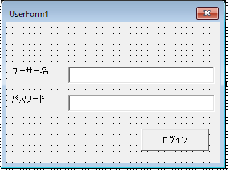

# VBAによるAPI連携例

ExcelなどOffice製品は、VBAマクロでMarkefanと連携してデータのインポートやエクスポートを行うことができます。

## Excel VBA サンプルコード

例えば、Excelで以下の動作をするVBAプログラムを作成して実行すると、Markefanのリード情報をExcelに出力することができます。

1. ログインAPI を呼び出し、Markefanにログインする。
2. リード取得API を呼び出し、Markefanのリード情報をJSONで取得する。
3. 上記で取得したJSONをExcelセルに格納する。

### 1. Makerfanにログインしてログイン情報を取得するフォームのコード

以下のフォームを作成し、ログインボタンにログインAPIをCallするコードを作成します。  



|オブジェクト|キャプション|オブジェクト名|
|:---:|:---:|:---:|
|テキストボックス|ユーザー名|txtUserName|
|テキストボックス|パスワード|txtPassword|
|ボタン|ログイン|btnLogin|

```vb
Private Sub btnLogin_Click()
    '
    ' ログインボタン（btnLogin）クリック時に Markefan ログインAPIをCallする
    '
    Dim responseJson
    Dim userName
    Dim passwd
    
    userName = txtUserName.text
    passwd = cnvMD5(txtPassword.text)   ' ← パスワードはMD5でハッシュ化

    responseJson = loginApi(userName, passwd) ' ← ログインAPIを呼ぶ
    
    'resonseJson にログイン情報がJSON形式で戻ってきます。
    'Debug.Print (responseJson)
    '
    ' --- ここに responsJsonから必要な情報を取り出すコードを記述
    '
    
End Sub
```
ログインに成功した場合、responsJsonに出力されるJSON戻り値は以下の通りです。  
上記のログイン後の後続処理でAPIを使用する場合は、ここで取得した **userId** と **accessToken** の値をAPIのパラメータに指定します。
```json
{"code":200,
"message":"LOGIN SUCCESS",
"status":"OK",
"generatedId":null,
"generatedIds":null,
"statusObject":"OK",
"account":{
    "code":"AccountBase",
    "accountId":9999（契約ID),
    "name":"（契約ユーザー名）",
    "companyName":"▢▢▢▢（会社名）",
    "companyUrl":null,
    "chatEnable":false,
    "creationDate":"yyyy-mm-dd hh:mm:ss"
    },
"user":{
    "userId":9999(ユーザーID),
    "name":"（ユーザー表示名）",
    "firstName":"（ユーザー名）",
    "lastName":"（ユーザー姓）",
    "role":0
    },
"auth":{
    "accessToken":"xxxxxxxx-xxxx-xxxx-xxxx-xxxxxxxxxxxx",
    "tokenType":"bearer",
    "refreshToken":"xxxxxxxx-xxxx-xxxx-xxxx-xxxxxxxxxxxx",
    "expiresIn":3000,
    "scope":"[read, trust, write]"
    }
}
```


標準モジュールには、ログインAPIを呼び出すコードを作成します。

```vb
Public Function loginApi(userName, passwd) As String
      '-----------------
      'リクエスト生成
      '-----------------
      'URL（必要に応じて変更）
      Dim url As String
      url = "https://lead-nurture.com/SpringRest/account/user/login"
      
      'パラメータ（必要に応じて動的に生成）
      Dim paramStr As Variant
      paramStr = "username=" & userName & "&password=" & passwd
      
      '--------------
      'POST実行
      '--------------
      Dim xmlhttp As Object
      Set xmlhttp = CreateObject("MSXML2.XMLHTTP")
      Call xmlhttp.Open("POST", url, False)
      Call xmlhttp.setRequestHeader("Content-Type", "application/x-www-form-urlencoded")
      Call xmlhttp.setRequestHeader("Content-Length", Len(paramStr))
      Call xmlhttp.send(paramStr)       'パラメータ
  
      '--------------
      '応答取得
      '--------------
      Dim retCd As String
      retCd = xmlhttp.Status    '結果コード取得
        ' Debug.Print retCd
      ' リターンコード 200 が正常にログインした場合はJSON戻り値をセット
      If retCd <> 200 Then
          Debug.Print "error:" & retCd
      Else
          Dim retHtml As String
          retHtml = xmlhttp.responseText    '結果HTML取得
          '
          'Debug.Print retHtml
          '
          ' --- ここにretHtmlから必要な情報を取り出すコードを記述します
          '
      End If
End Function
```

パスワードはMD5にハッシュ化してAPIに渡す必要があります。  
以下のMD5を生成するコードを標準モジュールに追加します。

```vb
'[ツール]-[参照設定]で次を追加してください。
'・Microsoft XML, v6.0(Win7以前はv2.0, Win8以降はv6.0)
'・mscorlib.dll(.NET Framework)
 
Public Function cnvMD5(instring) As String
 
    '入力データはUTF-8文字列とする
    Dim encoding As New utf8encoding
     
    Dim inbytes() As Byte
    Dim digester As Variant
    Dim hashbytes() As Byte
 
    'ハッシュ化する文字列
    inbytes = encoding.GetBytes_4(instring)

    Set digester = New MD5CryptoServiceProvider 'mscorlib.dllが必要
    hashbytes = digester.ComputeHash_2(inbytes)
    Debug.Print "MD5    : " & encodeToHex(hashbytes)

    cnvMD5 = encodeToHex(hashbytes) 
End Function
 
'バイト列を16進数形式の文字列にエンコードする。
Function encodeToHex(bytes() As Byte)
    encodeToHex = encode("bin.Hex", bytes)
End Function
 
'バイト列を指定タイプの文字列にエンコードする。
Function encode(dataType As String, bytes() As Byte)
    Dim oXmlDoc As New DOMDocument60 'Microsoft XML, v6.0が必要
    With oXmlDoc
        .LoadXML ("<root />")
        .DocumentElement.dataType = dataType
        .DocumentElement.nodeTypedValue = bytes
    End With
    encode = Replace(oXmlDoc.DocumentElement.text, vbLf, "")
End Function
```

### 2. Markefanのリード情報をJSONで取得するコード


### 3. JSONで取得した情報をExcelのセルに格納するコード

