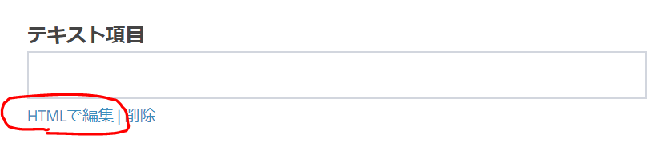
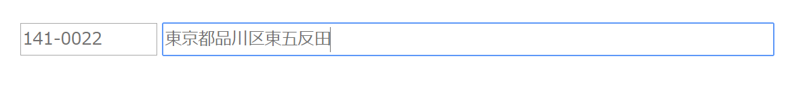

# フォームスクリプト  

Markefanでは、「静的フォーム」または「ダイナミックフォーム」を使用してホームページからリードの情報を収集します。
「ダイナミックフォーム」を使用すると収集するデータ項目を自由に指定することができますが、エディタの既定の機能では項目の配置や装飾などを行うことができません。しかしHTML編集を行うことにより、以下のような項目の装飾を行うことができます。



ユーザーに入力を促すような魅力的なフォームとするには、ダイナミックフォームで以下のような装飾を行ってみましょう。 

## 日付入力時のカレンダー表示[（実行例）](https://staging.lead-nurture.com/form/dynamicForm/9/412)  

- 

``` html
<div class="element-date">
    <label class="title">Date</label>
    <input class="large" data-format="yyyy-mm-dd" type="date" name="date" placeholder="yyyy-mm-dd">
</div>
```

## 郵便番号による住所自動入力[（実行例）](https://lead-nurture.com/form/dynamicForm/22/129)  

- 

``` html
<!-- オープンソースのMITライセンス「ajaxzip3」ライブラリを利用しています。 -->
<script src="https://ajaxzip3.github.io/ajaxzip3.js" charset="UTF-8"></script>
<!-- ▼郵便番号入力フィールド(7桁) -->
<input type="text" name="zip11" size="10" maxlength="8" onkeyup="AjaxZip3.zip2addr(this,'','addr11','addr11');">
<!-- ▼住所入力フィールド(都道府県 以降の住所) -->
<input type="text" name="addr11" size="60">
```
